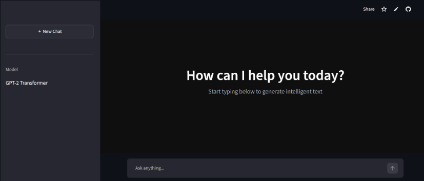
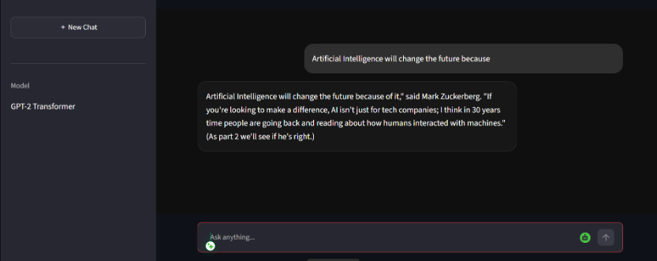

<div align="center">

# 🤖 AI Text Generator Using GPT-2 Transformer

### 🚀 Prodigy GenAI Internship — Task 01


<br>


</div>


---

# 📌 Project Overview

This project is developed as part of the **Prodigy GenAI Internship Task-01**.

The objective of this project is to develop an intelligent text generation application using the **GPT-2 (Generative Pre-trained Transformer 2)** model.

The application uses Natural Language Processing (NLP) techniques to understand a given text prompt and generate meaningful human-like continuation text.


---

# 🧠 About GPT-2 Model

GPT-2 is a transformer-based deep learning language model designed for natural language generation.

It works by analyzing the input sequence and predicting the most suitable next words based on learned language patterns.

### GPT-2 Workflow

```text
User Input Prompt

        ↓

Text Tokenization

        ↓

GPT-2 Transformer Model

        ↓

Language Prediction

        ↓

Generated Text Output
```


---

# 📸 Project Screenshots


## 🏠 Application Interface




<br>


## 🤖 Generated Text Output




---

# ✨ Features

✔ GPT-2 based text generation

✔ Interactive AI web application

✔ User-friendly interface

✔ Real-time text generation

✔ Natural Language Processing

✔ Transformer-based architecture

✔ Streamlit deployment ready


---

# 🛠️ Technology Stack


| Technology | Purpose |
|----------|---------|
| Python 🐍 | Programming Language |
| Streamlit 🎨 | Web Application Framework |
| Hugging Face 🤗 | Transformer Model Library |
| GPT-2 🧠 | Text Generation Model |
| PyTorch 🔥 | Deep Learning Backend |
| GitHub 🚀 | Version Control |


---

# 📂 Project Structure


```bash
PRODIGY_GA_01

│
├── assets
│   |
│   └── images
│       |
│       ├── home.png
│       |
│       └── result.png
│

├── app.py

├── requirements.txt

└── README.md

```


---

# ⚙️ Installation & Setup


## 1. Clone Repository

```bash
git clone https://github.com/USERNAME/PRODIGY_GA_01.git
```


## 2. Move Into Project Folder

```bash
cd PRODIGY_GA_01
```


## 3. Install Dependencies

```bash
pip install -r requirements.txt
```


## 4. Run Application

```bash
streamlit run app.py
```


---

# 📦 Required Libraries


```txt
streamlit

transformers

torch
```


---

# 🚀 How It Works


1. User enters a text prompt

2. Prompt is processed using Hugging Face tokenizer

3. GPT-2 transformer model generates continuation text

4. Generated AI response is displayed through Streamlit interface


---

# 📚 Learning Outcomes


Through this project, learned:

✔ Generative AI concepts

✔ Transformer architecture basics

✔ GPT-2 text generation

✔ Hugging Face pipeline implementation

✔ Streamlit application development

✔ GitHub project workflow


---

# 🔮 Future Enhancements


🔹 Add multiple AI models

🔹 Fine-tune GPT-2 with custom datasets

🔹 Improve response quality

🔹 Add conversation memory

🔹 Enhance UI/UX design


---

# 🏆 Internship Information


**Internship:** Prodigy GenAI Internship

**Task:** 01

**Project:** Text Generation using GPT-2


---

<div align="center">

## ⭐ Task-01 Successfully Completed ⭐


### Built using Generative AI 🤖

</div>